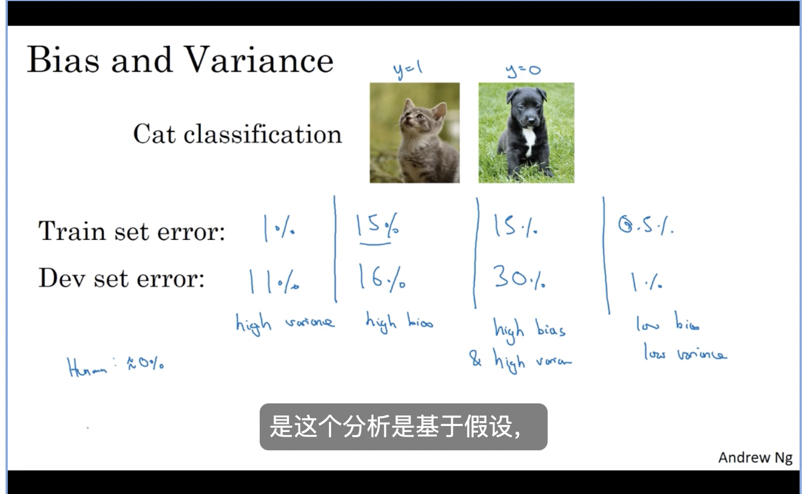
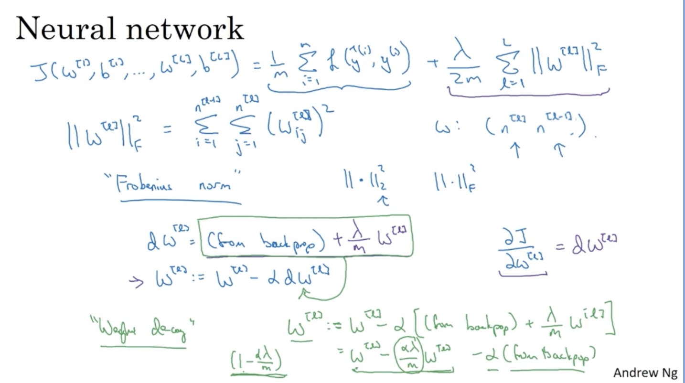
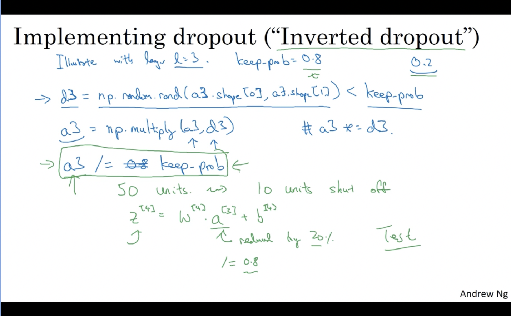
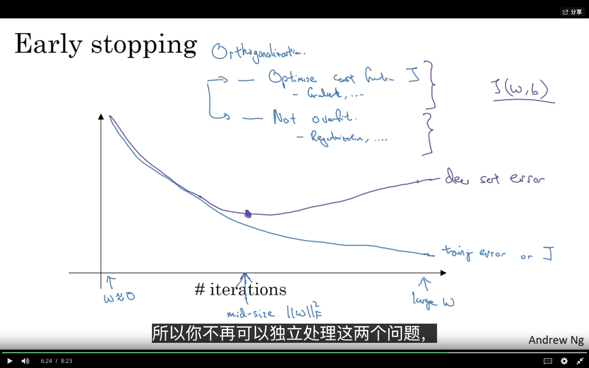
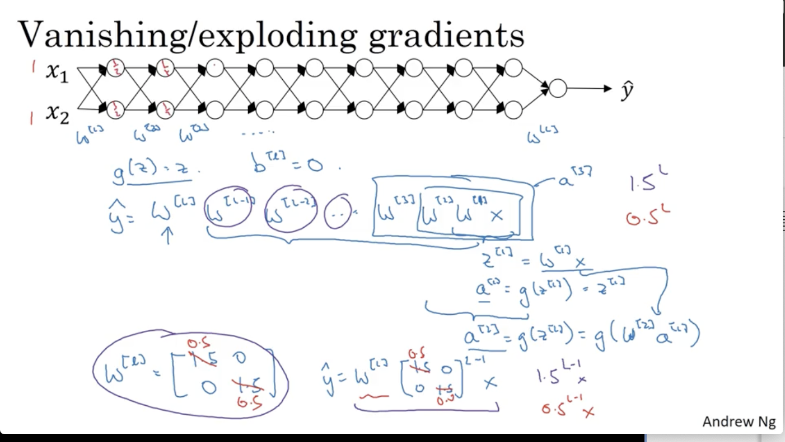
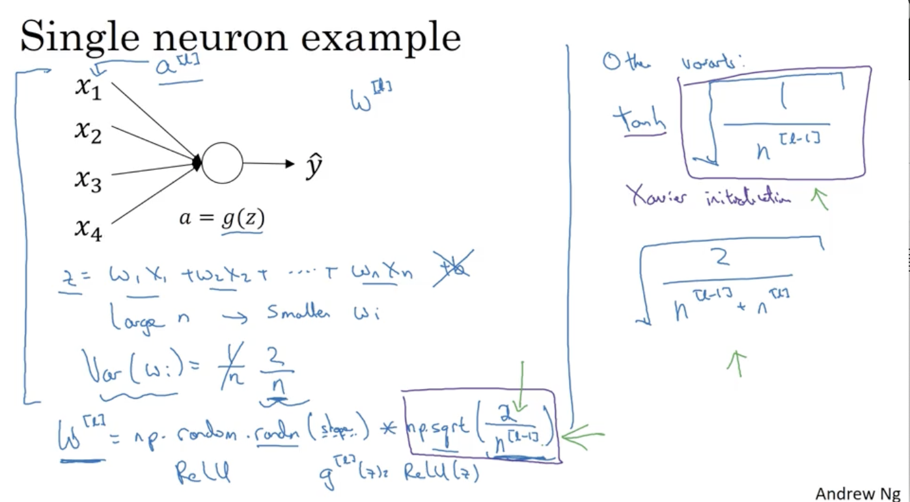
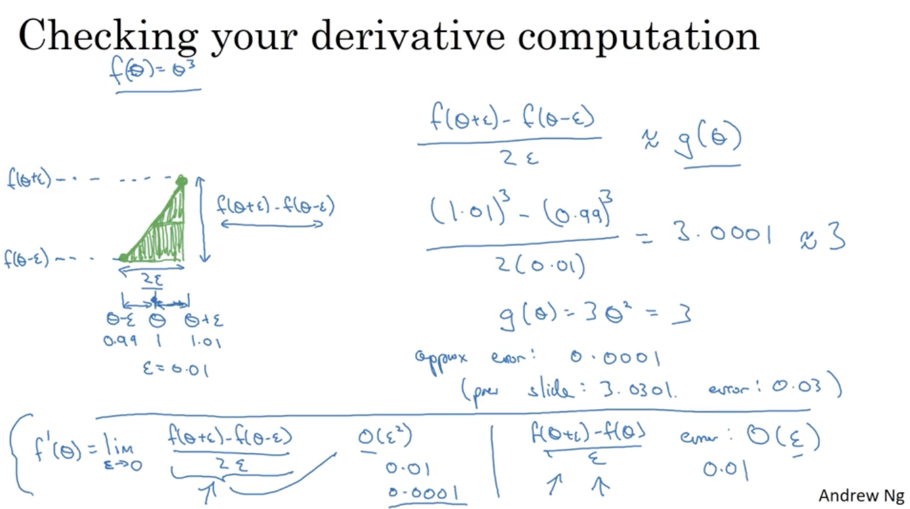
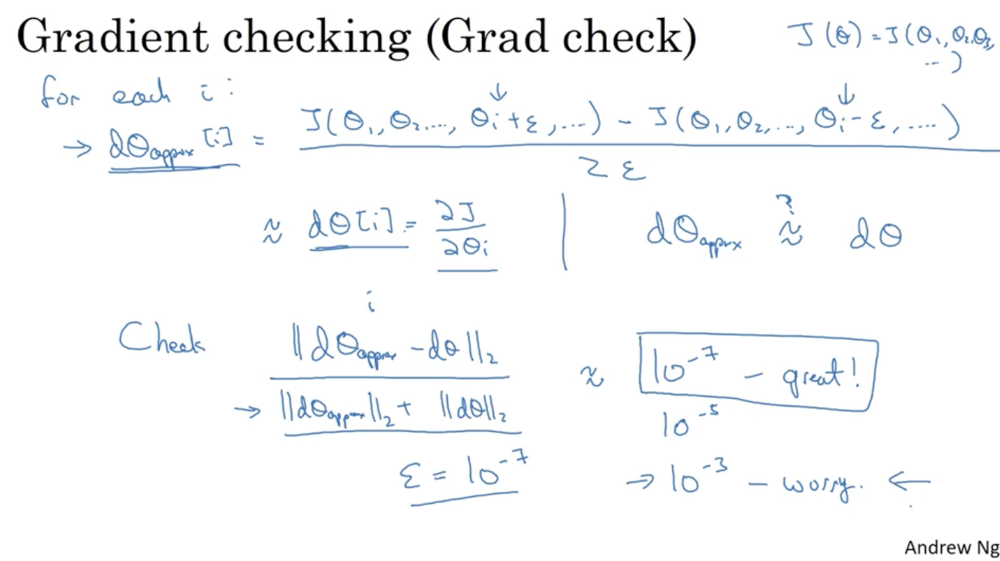

## Setting up your Machine Learning Application

### Train/Dev/Test sets

当样本数据量较少的时候，train/dev/test一般会选择遵循60/20/20的规则，但数据量大的时候，dev、test的数据所占的比例可能远小于20

__make sure about train, dev, test has the same distribution!__

### Bias/Variance

Variance ：train & dev 之间的差距

Bias：train的训练情况

### Basic Recipe for Machine Learning

1. 判断是否有high bias，如果有着较高的high bias，那么构建一个新的神经网络，通过更多的hidden layer或者hidden unit或者训练更长的时间或者换用一些更加高级的优化算法
2. 判断是否有high variance，如果有着较高的high variance，那么就可以通过获取更多的数据或者尝试正则化处理。

## Regularizing your neural network

### Regularzation

遇到high variance时，可以通过get more data or regularzation来解决，但get more data并不总能够实现。

L2 regularizing:

 $J(W,b)=\frac{1}{m}\sum_\limits{i=1}^mL(\hat{y}^{[i]},y^{[i]})+\frac{\lambda}{2m}||W||_2^2$

$||W||_2^2=\sum_\limits{j=1}^{n_x}w^2_j=W^TW$

L1 regularizing:

$J(W,b)=\frac{1}{m}\sum_\limits{i=1}^mL(\hat{y}^{[i]},y^{[i]})+\frac{\lambda}{2m}||W||_1$

$||W||_1=\sum_\limits{i=1}^{n_x}|w_i|$

#### L2 regularizing:

$dw^{[l]}=\frac{1}{m}dZ^{[l]}A^{[l-1]T}+\frac{\lambda}{m}W^{[l]}$

权重矩阵W乘以了一个小于1的数字

### dropout regularizing

dev和test阶段就不要使用dropout regularizing，只会增加预测噪声

### Other regularization methods

1. 通过将图片旋转，放大等方式来获取更多的数据
2. 

## Setting up your optimization problem

### Normalizing inputs

if you use this to scale your training data, then use the same mu and sigma squared to normalize your test set

需要确保test & train中的数据通过同样的方式进行的转换

### Vanishing / Exploding gradients

What that means is that when you're training a very deep network your derivatives or your slopes can sometimes get either very, very big or very, very small, maybe even exponentially small, and this makes training difficult. 

### Weight initialization for Deep Network

### Numerical approximation of gradients

双侧检验来近似导数更加精确

### Gradient checking

$\theta_1,\theta_2...\theta_{2n}$可以看成$W1,b1,W2,b2....W_n,b_n$

### Gradient Checking Implementation Notes

1. Don't use in training - only to debug.
2. If algorithm fails grad check, look at components to try to identify bug.
3. remember regularization.
4. Dosen't work with dropout. 先将keepprob=1.0，如果正确了，那么再通过修改keepprob进行调整