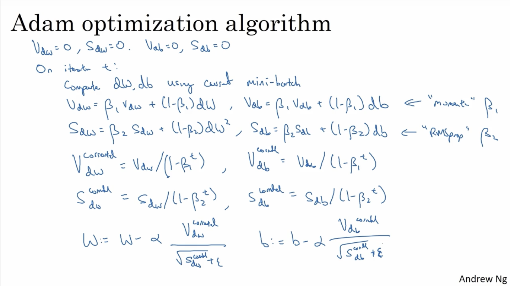

## optimization algorithms

### Mini-batch gradient descent

$X^{(i)}$表示的是第i个样本

$Z^{[L]}$表示第L 层

$Z^{\{L\}}$表示第L个mini-batch

大致就是将最开始的大量样本进行划分，对每一部分依次进行学习，调整参数

### Understanding mini-batch gradient descent

epoch：一次epoch是指将所有数据训练一遍的次数，epoch所代表的数字是指所有数据被训练的总轮数。 例如：有49000个数据，计划进行十轮训练，那么epoch=10；一次训练迭代训练100个数据，batchsize=100，训练一轮总共要迭代490次（49000/100=490）。

没有使用mini-batch的情况下，损失函数随着迭代次数必定下降 ，除非学习率过大等原因导致损失函数值上升。

在使用mini-batch的情况下，损失函数值随着每个batch的趋势是整体是下降的，但会存在波动。因为可能$X^{\{1\}},Y^{\{1\}}$中正确的label较多，cost function 的值较小，但在$X^{\{2\}},Y^{\{2\}}$中错误的label较多，cost function 的值较大，但整体还是一种下降的趋势。

If mini-batch size = m: batch gradient descent $X^{\{1\}},Y^{\{1\}}=X,Y$

If mini-batch size = 1: stochastic gradient descent   Every example is its own mini-batch

batch gradient descent: 每一次循环中花费时间过长，尤其在数据集特别大的时候。适用于训练集较小的情况。

stochastic gradient descent:比较准确，通过使用较小的学习率来降低噪声。缺点：不能通过vectorization来进行加速。

综上需要将mini-batch size设定在(1,m)之间

1. 不需要等到都遍历完一遍后，才进行梯度下降
2. 可以进行verctorization来进行加速

#### guidelines:

1. if you have a small training set, Just use batch gradient descent.
2. if you have a big training set, Anything from 64 up to maybe 512 are quite typical. And because of the way computer memory is layed out and accessed, sometimes your code runs faster if your mini-batch size is a power of 2.
3. make sure that mini batch all of your $X^{\{t\}},Y^{\{t\}}$ that fits in CPU/GPU memory.

### Exponentially weighted averages

$V_t=\beta V_{t-1}+(1-\beta)\theta_t$

$V_0=0$

$V_t\approx\frac{1}{1-\beta}\theta_t$

### Understanding exponentially weighted average

### Bias correction in exponentially weighted averages 

由于假设$V_0=0$就会导致刚开始预测气温时，预测结果偏小。为了避免这种情况应对预测结果进行调整$temperature=\frac{V_t}{1-\beta^{t}}$

 

### Gradient descent with momentum

slow learn rate: 竖直方向震荡较小，但水平方向学习速度太慢

fast learn rate:竖直方向oscillations较大，可能会偏离学习路线，

使用momentum时，垂直方向上的震荡倾向于平均值接近于0，水平方向的平均值依然很大。

### RMSprop

Root Mean Square prop

### Adam optimization algorithm

$\alpha$: needs to be tune

$\beta_1$:0.9 ($dW$)

$\beta_2$:0.999($dW^2$)

$\epsilon:10^{-8}$ 

一般情况下设置好$\beta_1,\beta_2,\epsilon$，尝试一系列$\alpha$的取值，看看哪些取值更合适。

Adom: adoptive moment estimation

### Learning rate decay

刚开始的时候学习率高，可以增大步长，更加接近最优值。但由于学习率较高，会导致一直在最优值附近徘徊，而不能获取最优值，此时就需要降低学习率，来增加系统的稳定性。

### Problem of plateaus

1. unlikely to get stuck in a bad local optima
2. Plateaus can make learning slow