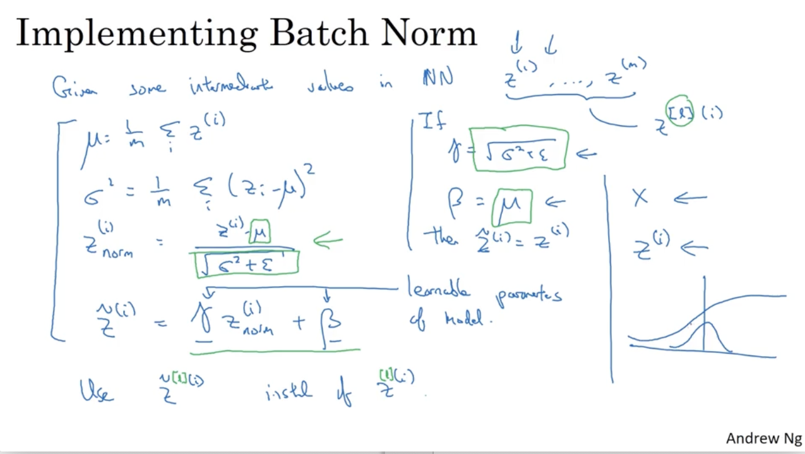

## Hyperparameter tuning

### Tuning process

$\alpha,\beta_1,\beta_2,\epsilon,layers,hidden \quad unit,learning\quad rate \quad decay,mini-batch\quad size$

### Using an appropriate scale to pick hyperparameters

if $\alpha$的取值设为0.0001,...,1：那么不应该采取均匀分布来随机获取alpha的取值，更应该以0.0001--0.001，0.001--0.01，0.01--0.1，0.1-1这4个区间等概率取值

python实现：

```python
r = -4*np.random.rand()#r属于[-4,0]
alpha = 10**r # alpha的取值范围[10**-4,1]
```

if $\beta$=0.9,...,0.999


### Hyperparameters tuning in practice: Pandas vs. Caviar


## Batch Normalization

### Normalizing activations in a network

在输入属性时，通过归一化处理，可以降低各个属性因尺度不同而造成的误差，并提升运行速度。

当面对多层NN时，第i层，我们都可以类似方法来对传入激活函数的数值进行调整（如下图所说），并带入到激活函数中，作为下一层的输入。



### Fitting batch norm into a neural network

$\beta$ in batch normalization is different from $beta$ in Adam


### Why does Batch Norm work?

看这篇文章

https://zhuanlan.zhihu.com/p/34879333

### Batch Norm at test time

计算test的$\mu,\sigma^2$时，先计算出每一个batch的对应的$X^{\{i\}}和{\sigma^{\{i\}}}^{2}$，并使用exponential weighted average，来确定最终的$\mu,\sigma^2$。


## Multi-class classification

### Softmax Regression


softmax layer:

1. 通过神经网络传递计算（$Z^{[L]}=W^{[l]}a^{[L-1]}+b^{[L]}$），计算出对应每个节点的值

2. 调用activation function，即

   （1.先计算$t_i=e^{z^{[L](i)}}$

      2.go on $a^{[L](i)}=\frac{t_i}{\sum_\limits{j=1}^4t_j}$）

### Training a softmax classifier

