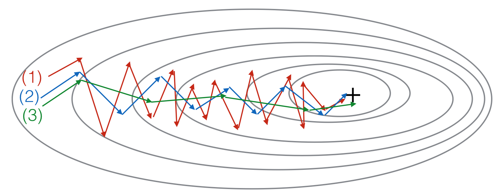

### 错题

1. Which of these statements about mini-batch gradient descent do you agree with?

   

   1. You should implement mini-batch gradient descent without an explicit for-loop over different mini-batches, so that the algorithm processes all mini-batches at the same time (vectorization). 

   2. Training one epoch (one pass through the training set) using mini-batch gradient descent is faster than training one epoch using batch gradient descent.

   3. One iteration of mini-batch gradient descent (computing on a single mini-batch) is faster than one iteration of batch gradient descent.

   3是正确

2. You use an exponentially weighted average on the London temperature dataset. You use the following to track the temperature: $vt=βv_{t−1}+(1−β)θ_t$ . The red line below was computed using *β*=0.9. What would happen to your red curve as you vary *β*? (Check the two that apply)

Increasing *β* will shift the red line slightly to the right.

Decreasing *β* will create more oscillation within the red line.

3. 

(1) is gradient descent. (2) is gradient descent with momentum (small β). (3) is gradient descent with momentum (large β)	