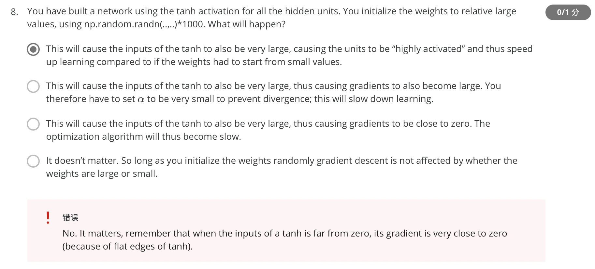

### 错题

1. The tanh activation usually works better than sigmoid activation function for hidden units because the mean of its output is closer to zero, and so it centers the data better for the next layer. True/False?

   #### Answer：

   No. As seen in lecture the output of the tanh is between -1 and 1, it thus centers the data which makes the learning simpler for the next layer.

2. Logistic regression’s weights w should be initialized randomly rather than to all zeros, because if you initialize to all zeros, then logistic regression will fail to learn a useful decision boundary because it will fail to “break symmetry”, True/False?

   #### Answer:

   True, Logistic Regression doesn't have a hidden layer. If you initialize the weights to zeros, the first example x fed in the logistic regression will output zero but the derivatives of the Logistic Regression depend on the input x (because there's no hidden layer) which is not zero. So at the second iteration, the weights values follow x's distribution and are different from each other if x is not a constant vector. 

3. 

4. 