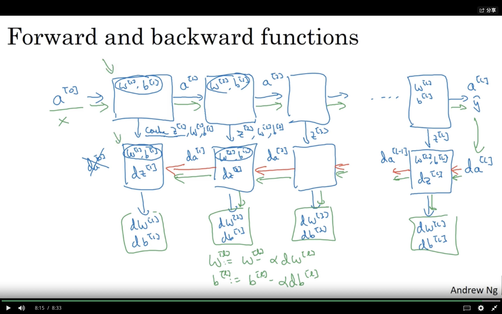
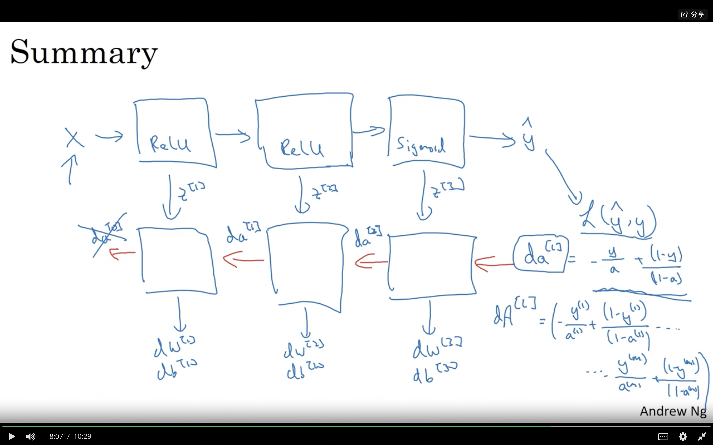

### Forward Propagation in a Deep Network

$Z^{[l]}=W^{[l]}A^{[l-1]}+b^{l}$

$A^{[l]}=g^{[l]}(Z^{[l]})$

每一层中的W的dimensional为$(n^{[l]},n^{[l-1]})$

每一层中的b的dimensional为$(n^{[l]},1)$

dw should be the same dimension as w

db should be the same dimension as b

$Z^{[l]},A^{[l]}$' dimensional is $(n^{[l]},m)$

### Forward and Backward Propagation

$dZ^{[l]}=dA^{[l]}*g^{[l]'}(Z^{[l]})$

$dw^{[l]}=\frac{1}{m}dZ^{[l]}A^{[l-1]T}$

$db^{[l]}=\frac{1}{m}np.sum(dZ^{[l]},axis=1,keepdim=True)$

$dA^{[l-1]}=W^{[l]T}dZ^{[l]}$

### Parameters vs Hyperparameters

parameter: $W^{[i]},b^{[i]}$

Hyperparameters:$learn\quad rate,iteration\quad number,hidden \quad layers,hidden\quad units,choice\quad of \quad activation\quad function $

