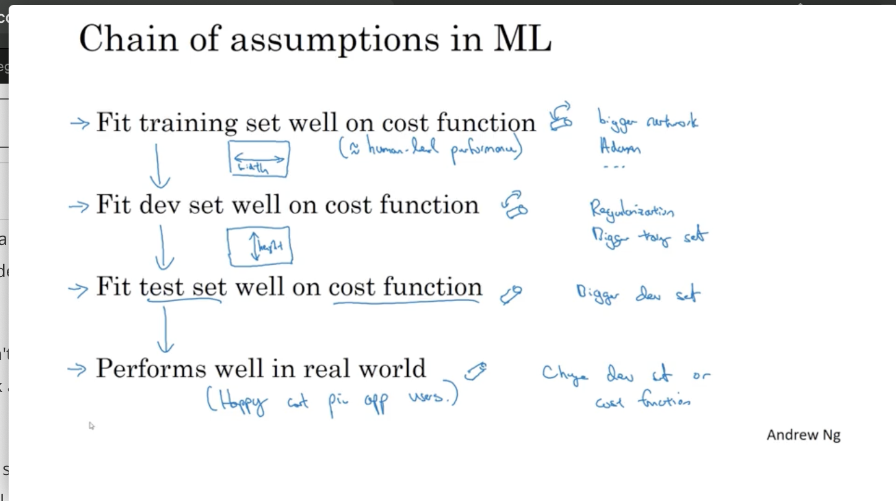
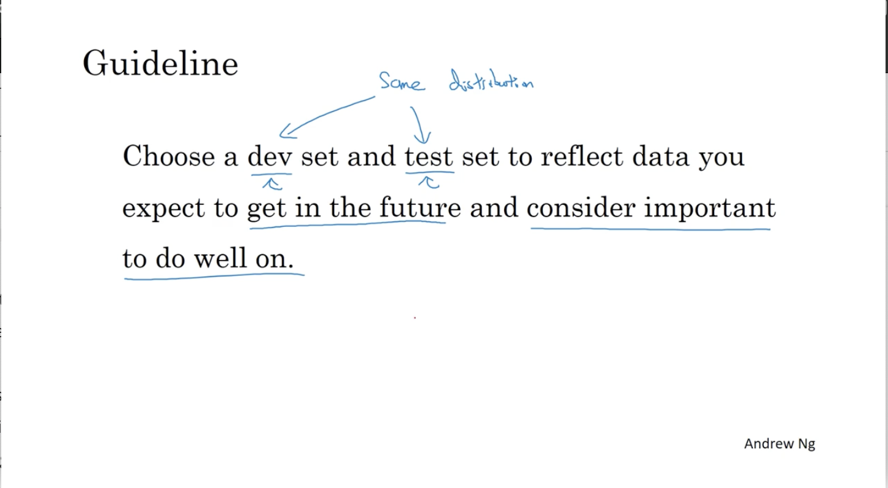
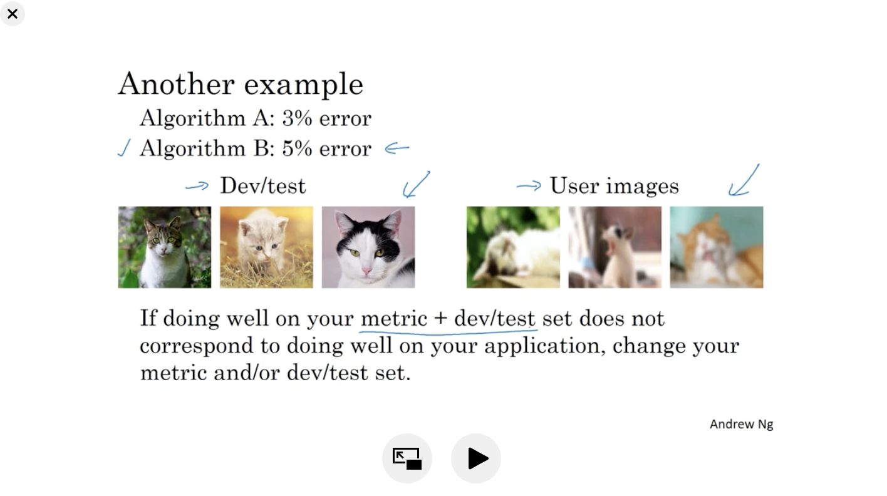
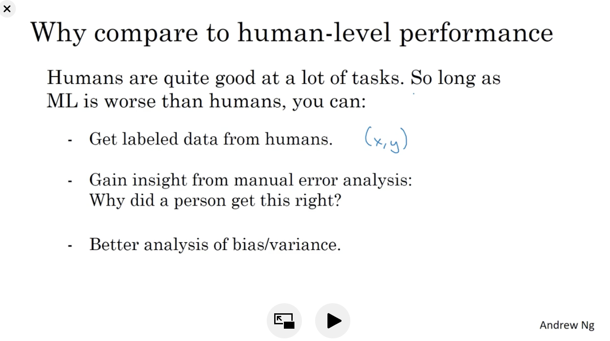
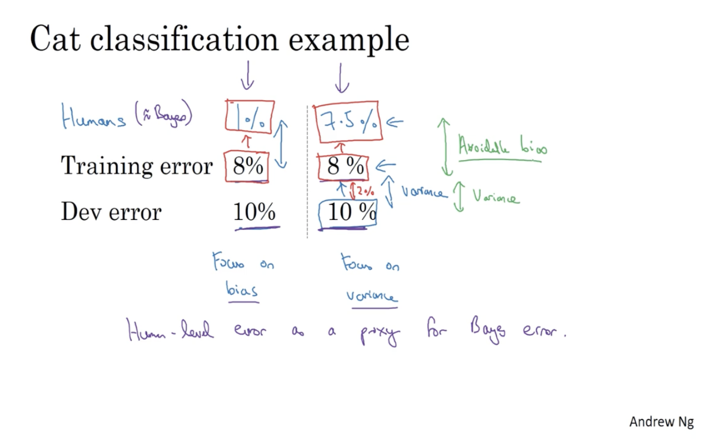
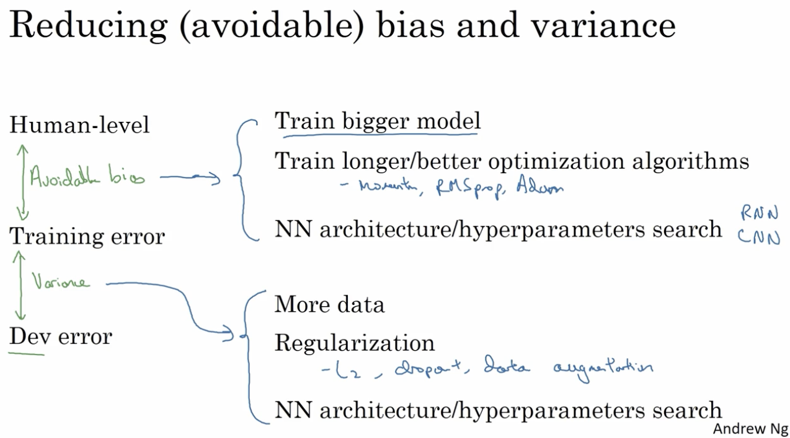

## Introduction to ML Strategy

### Orthogonalization美  [ɔ:,θɔɡənəlai'zeiʃən]

流程图：

## Setting up your goal

### Satisficing and Optimizing metric

So more generally, if you have N matrix that you care about it's sometimes reasonable to pick one of them to be optimizing. So you want to do as well as is possible on that one. And then N minus 1 to be satisficing, meaning that so long as they reach some threshold such as running times faster than 100 milliseconds, but so long as they reach some threshold, you don't care how much better it is in that threshold, but they have to reach that threshold.

### Train/dev/test distributions

### Size of the dev and test sets

样本数量相对较小时：

​		 *70/30: train/test*

​		*60/20/20: train/dev/test*

样本数量相对较多时（如1,000,000以上时）：

​		98/1/1:train/dev/test

### When to change dev/test sets and metrics

如果在实际中出现了用户不想出现的东西时候（如porn之类的），可能新建立一个metrics来确定是否会选用错误率较高的那个algothrim。

## Comparing to human-level performance

### Why human-level performance?

### Avoidable bias

Avoidable bias = Train error - Bayes error (Humans error)

### Understanding human-level performance

f you're trying to understand bias and variance where you have an estimate of human-level error for a task that humans can do quite well, you can use human-level error as a proxy or as a approximation for Bayes error.And so the difference between your estimate of Bayes error tells you how much avoidable bias is a problem, how much avoidable bias there is. And the difference between training error and dev error, that tells you how much variance is a problem, whether your algorithm's able to generalize from the training set to the dev set. 

### Improving your model performance

