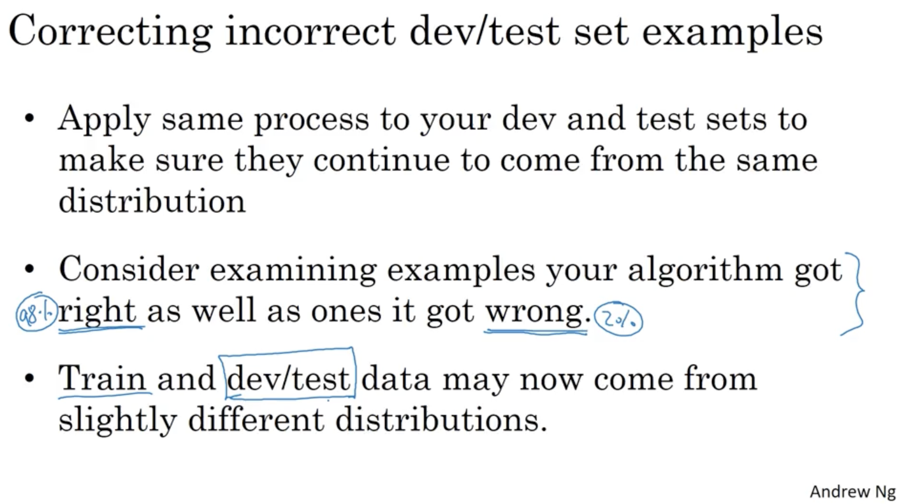

## Error Analysis

### Carrying out error analysis

If your learning algorithm is not yet at the performance of a human. Then manually examining mistakes that your algorithm is making, can give you insights into what to do next. This process is called error analysis. 

错误率较高的情况时，首先先去看看数据，对mislabel的数据进行整理，尝试找出其中的问题。

### Cleaning up incorrectly labeled data

Train set:	

​	DL algorithms are quite robust to random errors in the training set.

​	如果数据量很大，且存在一些随机的mislabel的比例很小，不太影响训练结果。

​	There is one caveat to this which is that deep learning algorithms are robust to random errors. They are less robust to systematic errors.

Dev/ Test set:

​	My advice is, if it makes a significant difference to your ability to evaluate algorithms on your dev set, then go ahead and spend the time to fix incorrect labels. But if it doesn't make a significant difference to your ability to use the dev set to evaluate cost bayes, then it might not be the best use of your time. 

对比不同方案的errors due to incorrect labels在overall dev set error的比重，如果比值较大，那么就需要对dev的label进行整理。

### Build your first system quickly,then iterate

## Mismatched training and dev/tests set

### Bias and Variance with mismatched data distributions

Training-dev set不用于训练

### Addressing data mismatch

## Learning from multiple tasks

### Transfer learning

Transfer learning：先建立一个网络，做到实现了自己设定的目标时。可以把这个网络进行微调，来适用于一个类似的应用。

例如：先创建一个图片识别的NN，调整好参数之后，对NN进行微调，应用于X-ray diagnosis 

 

So to summarize, when does transfer learning make sense? If you're trying to learn from some Task A and transfer some of the knowledge to some Task B, then transfer learning makes sense when Task A and B have the same input X. In the first example, A and B both have images as input. In the second example, both have audio clips as input. It has to make sense when you have a lot more data for Task A than for Task B. All this is under the assumption that what you really want to do well on is Task B. And because data for Task B is more valuable for Task B, usually you just need a lot more data for Task A because you know, each example from Task A is just less valuable for Task B than each example for Task B. And then finally, transfer learning will tend to make more sense if you suspect that low level features from Task A could be helpful for learning Task B. And in both of the earlier examples, maybe learning image recognition teaches you enough about images to have a radiology diagnosis and maybe learning speech recognition teaches you about human speech to help you with trigger word or wake word detection. 

### Multi-task learning

So that's why I'm saying that with this setting, one image can have multiple labels. If you train a neural network to minimize this cost function, you are carrying out multi-task learning. Because what you're doing is building a single neural network that is looking at each image and basically solving four problems. It's trying to tell you does each image have each of these four objects in it. And one other thing you could have done is just train four separate neural networks, instead of train one network to do four things. But if some of the earlier features in neural network can be shared between these different types of objects, then you find that training one neural network to do four things results in better performance than training four completely separate neural networks to do the four tasks separately.

## Learning from multiple tasks

### Whether to use end-to-end deep learning 

