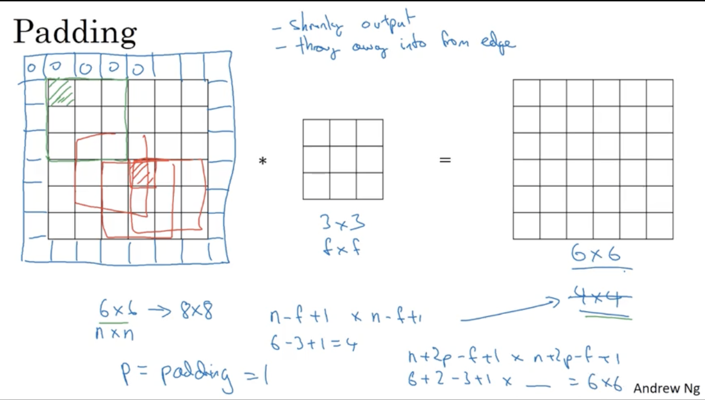

## Convolutional Neural Networks

### More Edge Detection

Sobel filter(vertical edge detect)

1 0 -1

2 0 -2

1 0 -1

the advantage of this is it puts a little bit more weight to the central row, the central pixel, and this makes it maybe a little bit more robust.

Scharr filter

3   0     -3

10 0    -10

3  0    -3

### Padding

n $\times$ n  image

f $\times$ f filter

Output: $(n-f+1)\times(n-f+1)$

在convolute的过程中，如果不做任何处理，那么经过多次convolute，就会使得最终的output的dimensions变得特别小，就会考虑在input外围添加一些0值，从而保证边界值也得到相应的权重，不然的话，边界被处理的次数小于中心被处理的次数。

output dimension after padding:$(n+2p-f+1)\times(n+2p-f+1)$

### Strided Convonlutions

Output:$\lfloor (\frac{n+2p-f}{s}+1)\rfloor\times\lfloor(\frac{n+2p-f}{s}+1)\rfloor$

### Convolutions Over Volume

### One layer of a Convonlutional Network

### Pooling Layers

max pooling 比 average pooling用的更加广泛

### CNN Example

### Why Convolutions?

