### Classic Networks

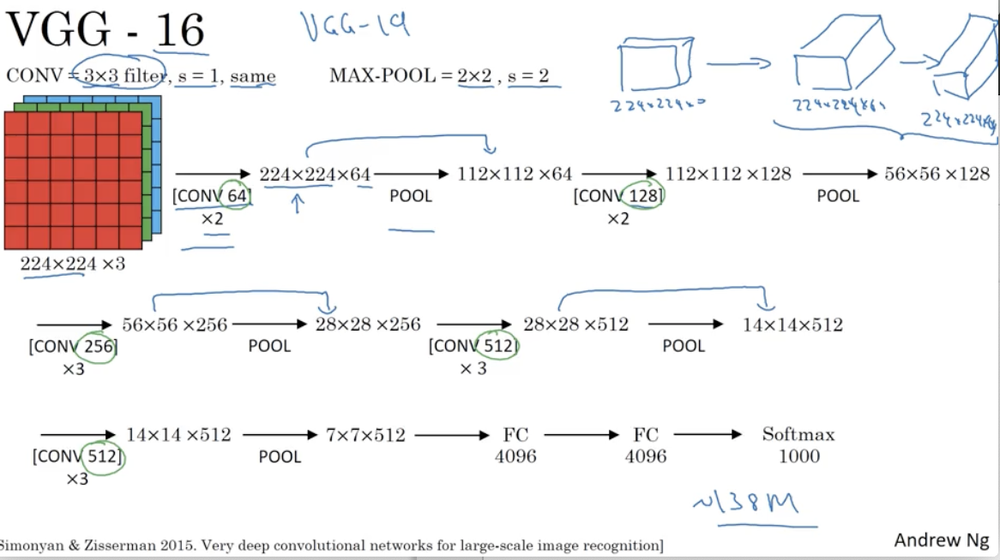

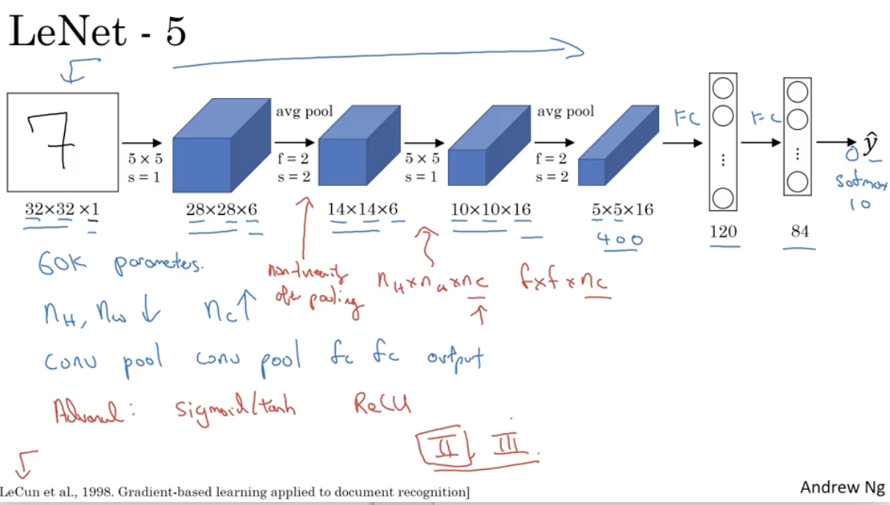

### ResNets

ResNets are built out of something called a residual block

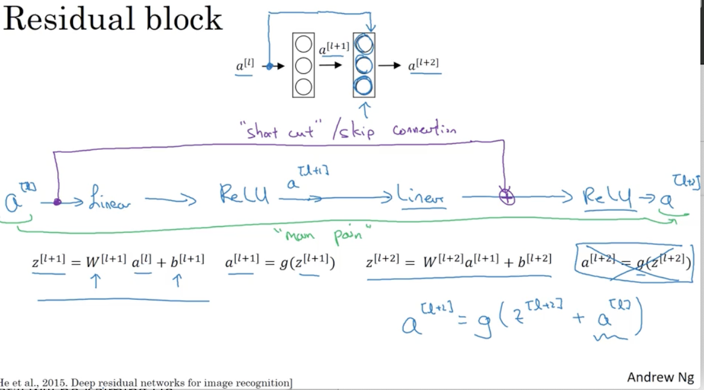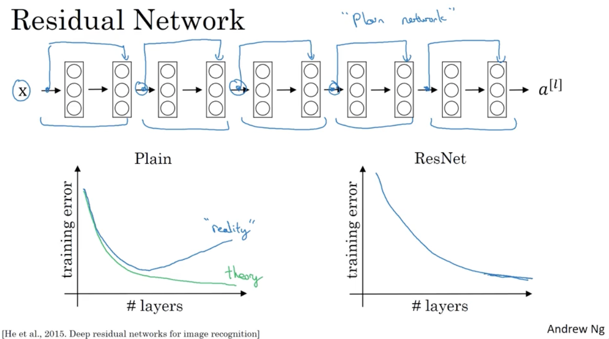

### Why ResNets work?

if you make a network deeper, it can hurt your ability to train the network to do well on the training set. 

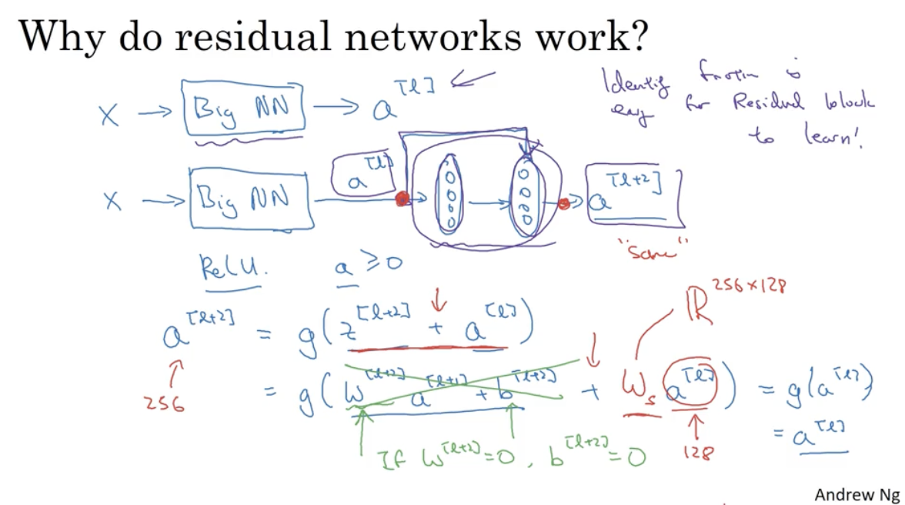

### Why dose a 1*1 convolution do?

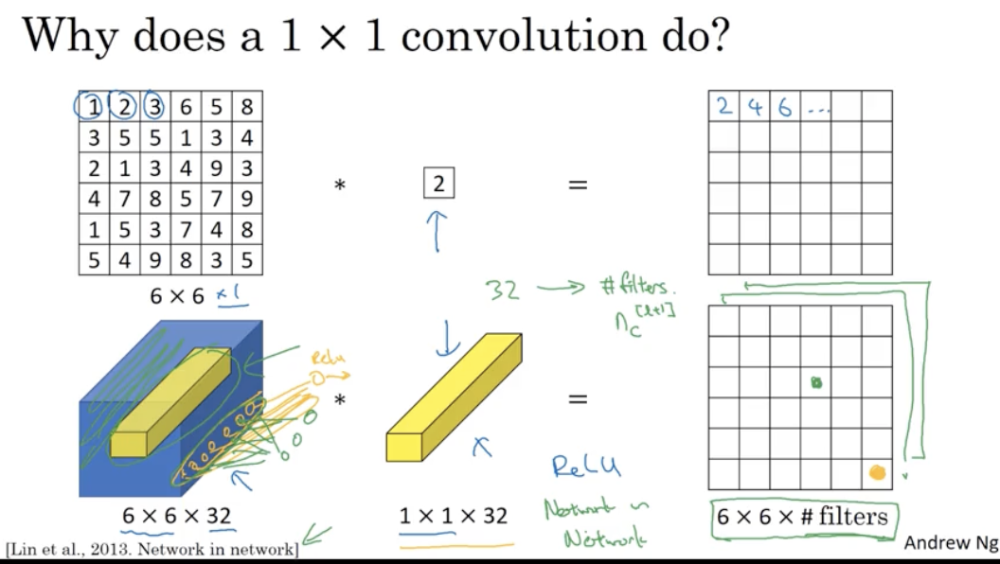缩小Chanel 的数量(n_c)

Pooling layer 可以缩小n_h & n_w

you've now seen how a one by one convolution operation is actually doing a pretty non-trivial operation and it allows you to shrink the number of channels in your volumes or keep it the same or even increase it if you want. 

### Inception Network Motivation

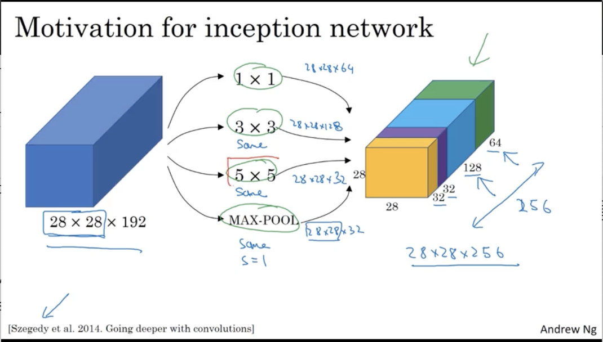

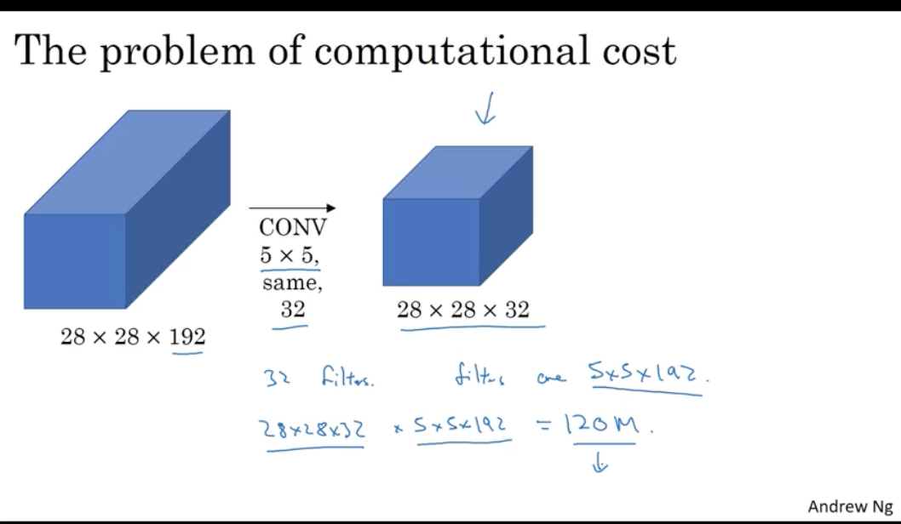减少计算量做法，其中28*28*16被称为bottleneck layer

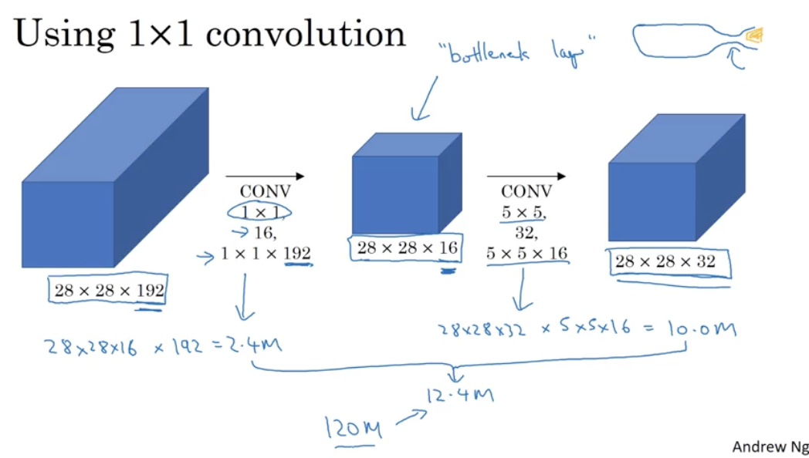

### Inception Network

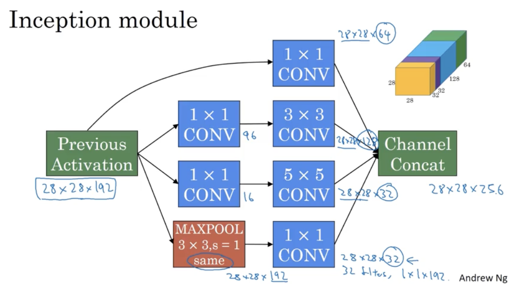

## Practical advices for using ConvNets

### Data Augmentation

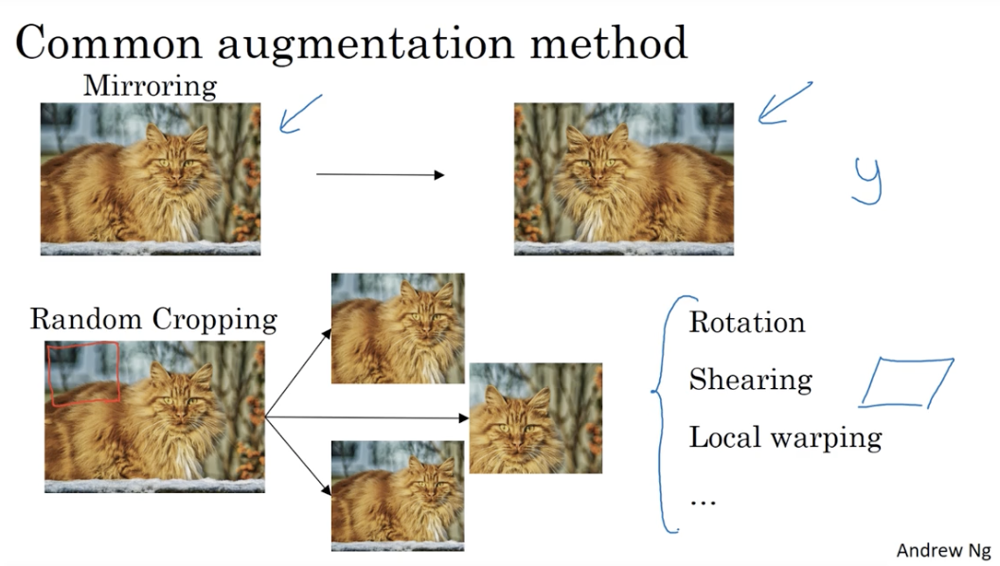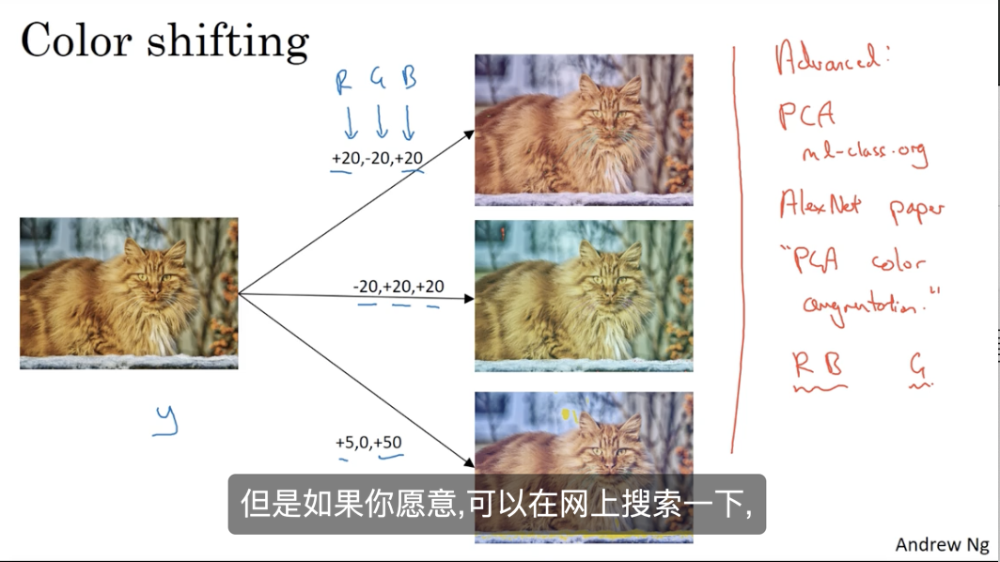

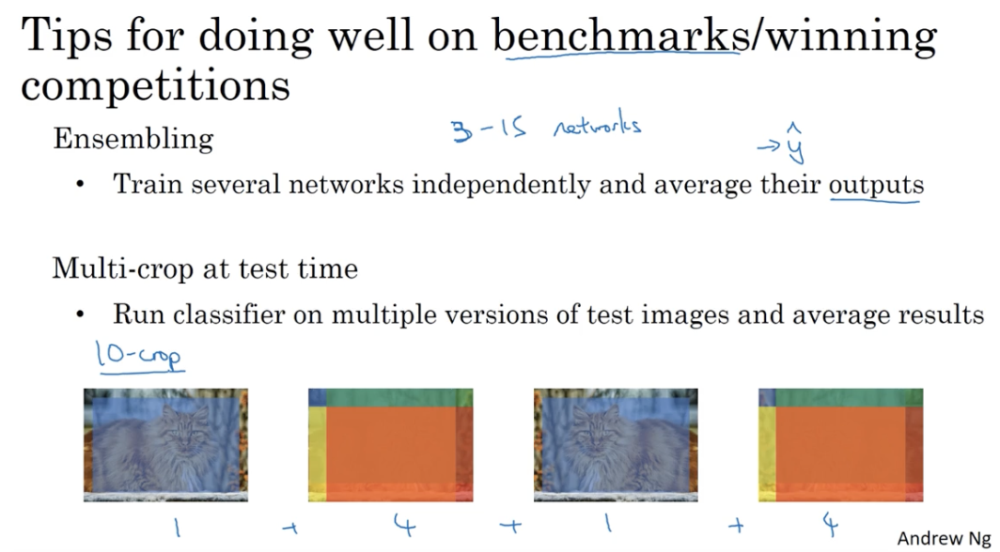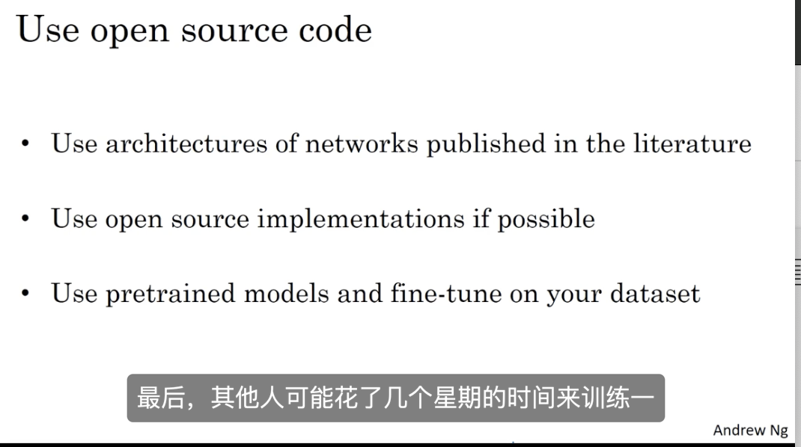