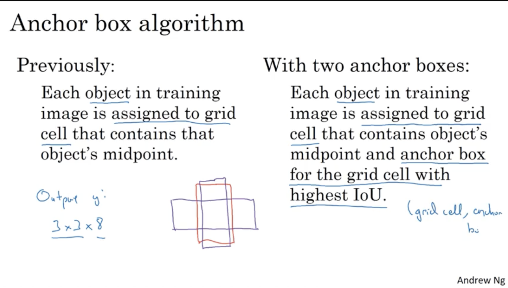

## Detection algorithms

### Object Localization

### Object Detection

缺点：

使用较小的windows，需要消耗大量的计算资源

使用较大的windows，不能特别准确的标注出Object的边框

### Convolutional Implementation of Sliding Windows 

### Bounding  Box Predictions

### Intersection Over Union

### Non-max Suppression

non-max means that you're going to output your maximal probabilities classifications but suppress the close-by ones that are non-maximal. 

### anchor boxes

So finally, how do you choose the anchor boxes? And people used to just choose them by hand or choose maybe five or 10 anchor box shapes that spans a variety of shapes that seems to cover the types of objects you seem to detect. As a much more advanced version, just in the advance common for those of who have other knowledge in machine learning, and even better way to do this in one of the later YOLO research papers, is to use a K-means algorithm, to group together two types of objects shapes you tend to get. And then to use that to select a set of anchor boxes that this most stereotypically representative of the maybe multiple, of the maybe dozens of object causes you're trying to detect. But that's a more advanced way to automatically choose the anchor boxes. 

### Yolo Algorithm

