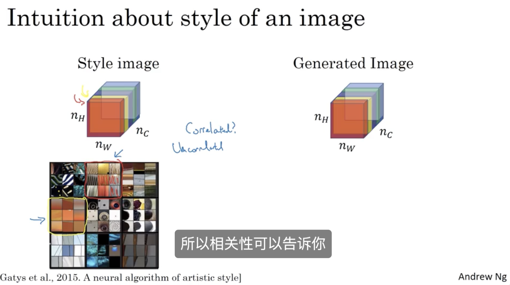

## Face Recognition

### What is face recognition?

### One Shot Learning 

So in the one shot learning problem, you have to learn from just one example to recognize the person again.

### Siamese Network

### Triplet Loss

### Face Verufucation and Binary Classification

如果是1就说明是同一个人，如果不是1那么就可以反向传播来改变传递的参数

## Neural Style Transfer

### What are deep ConvNets Learning?

### What are deep ConvNets learning?

But if we repeat this procedure, this is what you had previously for layer 1, and this is a visualization of what maximally activates nine different hidden units in layer 2. So I want to be clear about what this visualization is. These are the nine patches that cause one hidden unit to be highly activated. And then each grouping, this is a different set of nine image patches that cause one hidden unit to be activated.

 

### Neural style transfer cost function

we're going to define two parts to this cost function. The first part is called the content cost. This is a function of the content image and of the generated image and what it does is it measures how similar is the contents of the generated image to the content of the content image C. And then going to add that to a style cost function which is now a function of S,G and what this does is it measures how similar is the style of the image G to the style of the image S.

cost: $J(G)=\alpha J_{content}(C,G)+\beta J_{style}(S,G)$

J function calculates the similarity between A and B

### Style Cost Function

假设第一个channel对应于第一排第二个3*3

假设第二个channel对应于第二排第一个3*3

如果第一个channel与第二个channel高度相关，那么竖条纹与橙色极大可能会同时出现。

如果第一个channel与第二个channel不相关，那么出现竖条纹的过程中，极有可能不会出现橙色。

o the correlation tells you which of these high level texture components tend to occur or not occur together in part of an image and that's the degree of correlation that gives you one way of measuring how often these different high level features, such as vertical texture or this orange tint or other things as well, how often they occur and how often they occur together and don't occur together in different parts of an image. 

### 1D and 3D Generalizations

